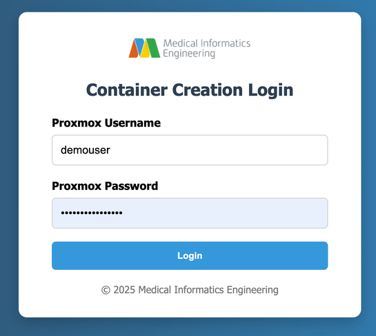
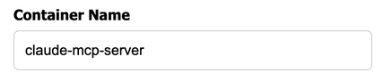
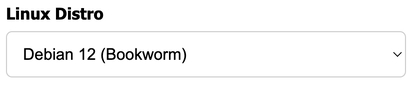
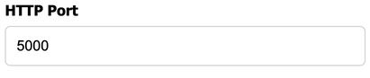
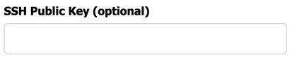

# Using The Web GUI
:::note Note
This walkthrough assumes that you already have a registered proxmox account in the cluster. If not, see [Introduction](/docs/intro.md).
:::

This guide shows you how to set up a basic LXC container on the MIE Opensource Proxmox Cluster using the a Web GUI. The Web GUI can be accessed at [https://create-a-container.opensource.mieweb.org](https://create-a-container.opensource.mieweb.org).

## 1. Authenticate Your Proxmox Account
 
Upon navigating, you will be prompted for your Proxmox Login Credentials, as shown in the image below:



**Options:**
- Enter your valid Proxmox username and password
- If authentication fails, you'll see a "Invalid username or password" message and be prompted again.

## 2. Choose a Container Hostname

This will be your container's subdomain:



**Options:**
- Use a single word containing only letters, numbers, and hyphens (e.g., `myapp`, `test-api`)
- The hostname will be available at `your-hostname.opensource.mieweb.org`
- If the name is already taken or contains invalid characters, you'll be asked to choose another

## 3. Select a Linux Distribution

This dropdown presents available distributions:



**Options:**
- Type `debian` for Debian 12 (Bookworm)
- Type `rocky` for Rocky Linux 9
- Any invalid input defaults to Debian

## 4. Set the HTTP Port

Specify which port your application will listen on:



**Options:**
- Any number between 80 and 60,000
- Common choices: 80, 3000, 8080, 5000, 8000
- Invalid entries will prompt you to try again

## 5. Configure SSH Access

Enter a public key from your local machine:



**Options:**
- Enter your SSH public key (starts with `ssh-rsa`, `ssh-ed25519`, etc.)
- Leave blank to skip SSH key configuration
- Invalid keys will prompt for a valid key or blank entry

:::important Important
Entering a public key is highly recommended. It will allow you to access the create-container command line setup without entering a password. Additionally, it will allow you to SSH to your container without having to input your proxmox password, making the connection process faster and more secure.

To create a private/public key pair on your machine, reference [this guide](https://docs.github.com/en/authentication/connecting-to-github-with-ssh/generating-a-new-ssh-key-and-adding-it-to-the-ssh-agent#generating-a-new-ssh-key).
:::

## 6. Container Creation Process

After providing all required information, the system will:
1. Transfer your configuration to the hypervisor
2. Begin the container creation process
3. Set up networking, DNS, and reverse proxy
4. Configure the container with your specified settings
5. Deploy your application if requested

Once the container creation process is complete, your container will be accessible via an ssh command in the form of:

```
ssh -p <your-container-port> <proxmox-username>@opensource.mieweb.org
```

## 7. Understanding the Output


---

**Advanced Options**: For multi-component deployments, custom environment variables, or specific service configurations, refer to the [Advanced Container Configuration](/docs/creating-containers/advanced-configuration) documentation or contact the MIE team.
